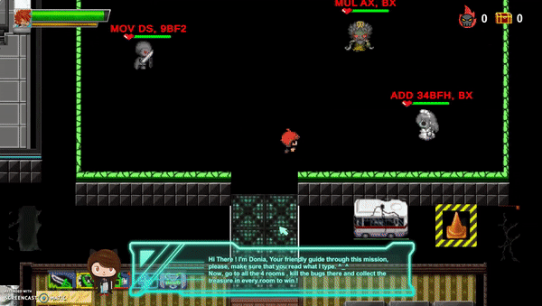
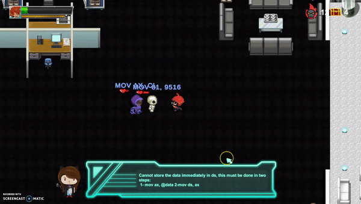
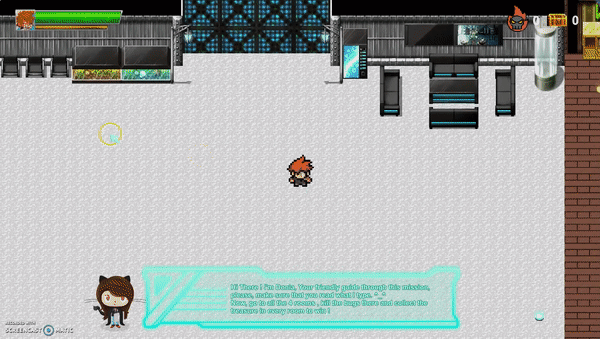
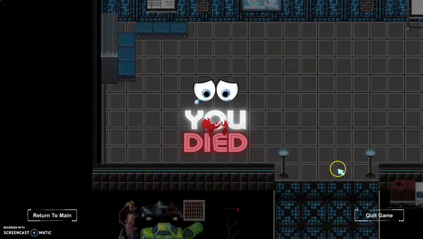

 <H1 align="center">

 Assembly-Hero ಠ_ಠ
 </H1>
<H1 align="center">

  </H1>
  <h1 align="center">

 </h1>
<h3 align="center">🎮 An Educational Game for Microprocessors Course. 🎮</h3>
<h3 align="center"> 

</h3>
  
<H1>
</a> Description And How to Play
 </H1>

- A company is working on an important 8086 assembly program but unluckily, the code failed to run with alot of errors.  
- The mission of assembly hero "YOU" is that you should go into the four room and kill all the bugs, 
 also you must collect the 4 treasures that has valuable microprocessor information into it. 
- The errors will be shown in the head of each enemy i.e each enemy is a bug,and those enemies ofcourse are trying to kill you,  
- When ever you kill an enemy, Donya, the assistant will display some information about this error for you 
that  will enrich your knowledge in assembly 8086 
 

   
<H1>
 Controllers
 </H1>

Move Player:  
____| w |____  
| a | | s | | d | 
 
or the Arrows ← ↑↓ →
 

-------------------------------------------- 

hit:  
- q or from the left click of the mouse 

-------------------------------------------- 
Pause:
-from ESC key
 

  
<H1>
 Demo
 </H1>
<h1 align= "center">
 
</h1>
<h1 align= "center">
 
</h1>
<h1 align= "center">
 
</h1>
<h1 align= "center">
 
</h1>
<h1 align= "center">
 
</h1>
 
<h1 align= "center">
 
</h1>
 
